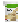

# Juego de la Viborita

## Como jugar

El objetivo del juego es hacer que la viborita coma lo más posible sin chocarse
contra ella misma. A medida que come, su cuerpo va creciendo, haciendo que cada
vez sea más difícil esquivarse a ella misma!

La viborita avanza sola, y es posible cambiar su dirección usando las flechas
del teclado o las teclas w, a, s y d.

## Las comidas

### Mate

El mate es la comida normal del juego, que aumenta el puntaje en 10 puntos e
incrementa el largo del cuerpo de la serpiente en 1.

### Whiskey

El Whiskey es una comida especial que incrementa el puntaje en 30 puntos, pero
invierte los controles temporalmente.

### Red Bull

La Red Bull hace que la serpiente incremente su velocidad temporalmente, e
incrementa el puntaje en 15 puntos.

### HerbaLife

El HerbaLife tiene como efecto reducir en 1 el largo del cuerpo de la serpiente,
aunque solo incrementa el puntaje en 5 puntos.

## Los niveles

El juego consta de tres niveles, cada uno más rápido que el anterior. Una vez
terminados los niveles, se acaba el juego.

Los puntajes necesarios para superar cada nivel son:

-   **Nivel 1**: 150 puntos.
-   **Nivel 2**: 450 puntos.
-   **Nivel 3**: 700 puntos.
